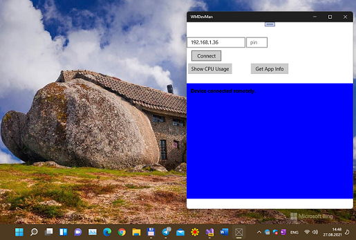

WMDevMan
========

#Project Name 

Windows 10 Mobile Device Manager (for PC, and, probably, mobile))

#About (Description)

Win10Mobile Connector and "lite" Portal mode realized. 

It runs on as #UWP app now... but win32 port planned (system tray support, etc.)!

#Project type 

sample (as "template" for dev other projects)

#Languages

C# (csharp)

#Used products (platforms):

UWP (build 15063)

#More tech details (architecture)

DeviceManager is a main part of WMDevMan. It is a class library for UWP developers to control 
users' device with advanced operation including shutdown, restart, GPU usage monitoring, 
APPX/XAP deployment, etc. I't useful thing for some debuging, IMHO

#Screenshots

")

